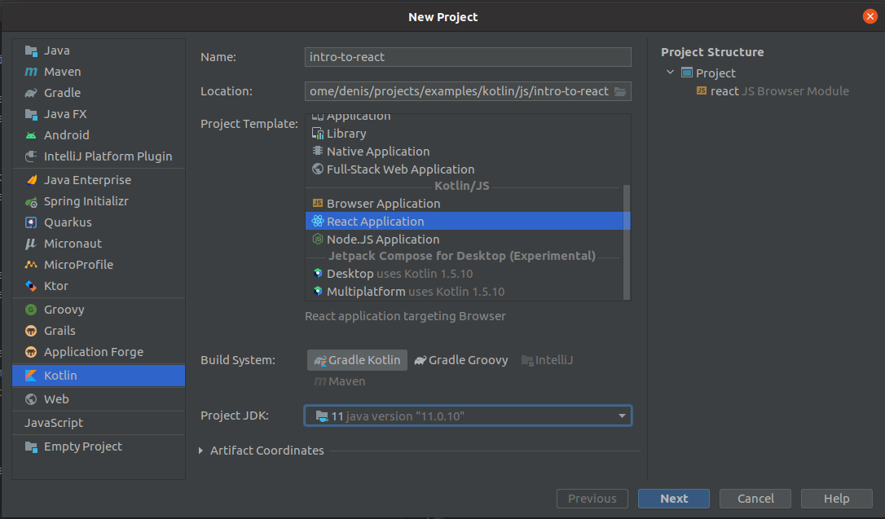
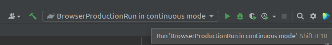
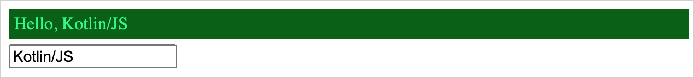

# Tutorial: Intro to React in Kotlin/JS

This is a Koltin implementation of [Tutorial: Intro to React](https://reactjs.org/tutorial/tutorial.html).

## Before We Start the Tutorial
We will build a small game during this tutorial. **You might be tempted to skip it because you’re not 
building games — but give it a chance**. The techniques you’ll learn in the tutorial are fundamental
to building any React app, and mastering it will give you a deep understanding of React.

The tutorial is divided into several sections:
- [Setup for the Tutorial]() will give you **a starting point** to follow the tutorial.
- [Overview]() will teach you **the fundamentals** of React: components, props, and state.
- [Completing the Game]() will teach you **the most common techniques** in React development.
- [Adding Time Travel]() will give you **a deeper insight** into the unique strengths of React.

You don’t have to complete all of the sections at once to get the value out of this tutorial. Try 
to get as far as you can — even if it’s one or two sections.

### What Are We Building?
In this tutorial, we’ll show how to build an interactive tic-tac-toe game with React.

You can see what we’ll be building here: [Final Result](). If the code doesn’t make sense to you, or
if you are unfamiliar with the code’s syntax, don’t worry! The goal of this tutorial is to help you 
understand React and its syntax.

We recommend that you check out the tic-tac-toe game before continuing with the tutorial. One of the
features that you’ll notice is that there is a numbered list to the right of the game’s board. This
list gives you a history of all of the moves that have occurred in the game, and it is updated as 
the game progresses.

You can close the tic-tac-toe game once you’re familiar with it. We’ll be starting from a simpler 
template in this tutorial. Our next step is to set you up so that you can start building the game.

### Prerequisites
We’ll assume that you have some familiarity with HTML and Kotlin/JS, but you should be able to 
follow along even if you’re coming from a different programming language. We’ll also assume that 
you’re familiar with programming concepts like functions, objects, arrays, and to a lesser extent, 
classes.

## Setup for the Tutorial
To get started, install the latest version of [IntelliJ IDEA](https://www.jetbrains.com/idea/download/).

### Create an application
Once you've installed IntelliJ IDEA, it's time to create your frontend application based on 
Kotlin/JS with React.

- In IntelliJ IDEA, select **File** | **New** | **Project**.
- In the panel on the left, select **Kotlin**.
- Enter a project name, select **React Application** as the project template, and click **Next**.

  By default, your project will use Gradle with Kotlin DSL as the build system.
- Select the **CSS Support** and **Use styled-components** checkboxes and click **Finish**.

[comment]: <> (Определиться какиее чекбоксы нужны !!! И вставить картинку с нужными чекбоксами)

Your project opens. By default, you see the file `build.gradle.kts`, which is the build script 
created by the Project Wizard based on your configuration. It includes the [kotlin("js") plugin and 
dependencies](https://kotlinlang.org/docs/js-project-setup.html) required for your frontend application.

### Run the application
Start the application by clicking **Run** next to the run configuration at the top of the screen.

Your default web browser opens the URL [http://localhost:8080/](http://localhost:8080/) with your 
frontend application.

Enter your name in the text box and accept the greetings from your application!

[comment]: <> (прикрепить ссылку на первый комит с приложением)