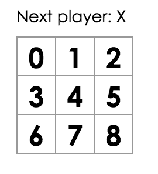

todo

- поменять ссылки на github проекта т.к. поменял тип данных

# Tutorial: Intro to React in Kotlin/JS

This is a Koltin implementation
of [Tutorial: Intro to React](https://reactjs.org/tutorial/tutorial.html).

## Before We Start the Tutorial

We will build a small game during this tutorial. **You might be tempted to skip it because you’re
not building games — but give it a chance**. The techniques you’ll learn in the tutorial are
fundamental to building any React app, and mastering it will give you a deep understanding of React.

The tutorial is divided into several sections:

- [Setup for the Tutorial]() will give you **a starting point** to follow the tutorial.
- [Overview]() will teach you **the fundamentals** of React: components, props, and state.
- [Completing the Game]() will teach you **the most common techniques** in React development.
- [Adding Time Travel]() will give you **a deeper insight** into the unique strengths of React.

You don’t have to complete all of the sections at once to get the value out of this tutorial. Try to
get as far as you can — even if it’s one or two sections.

### What Are We Building?

In this tutorial, we’ll show how to build an interactive tic-tac-toe game with React.

You can see what we’ll be building here: [Final Result](). If the code doesn’t make sense to you, or
if you are unfamiliar with the code’s syntax, don’t worry! The goal of this tutorial is to help you
understand React and its syntax.

We recommend that you check out the tic-tac-toe game before continuing with the tutorial. One of the
features that you’ll notice is that there is a numbered list to the right of the game’s board. This
list gives you a history of all of the moves that have occurred in the game, and it is updated as
the game progresses.

You can close the tic-tac-toe game once you’re familiar with it. We’ll be starting from a simpler
template in this tutorial. Our next step is to set you up so that you can start building the game.

### Prerequisites

We’ll assume that you have some familiarity with HTML and Kotlin/JS, but you should be able to
follow along even if you’re coming from a different programming language. We’ll also assume that
you’re familiar with programming concepts like functions, objects, arrays, and to a lesser extent,
classes.

## Setup for the Tutorial

To get started, install the latest version
of [IntelliJ IDEA](https://www.jetbrains.com/idea/download/).

### Create an application

Once you've installed IntelliJ IDEA, it's time to create your frontend application based on
Kotlin/JS with React.

- In IntelliJ IDEA, select **File** | **New** | **Project**.
- In the panel on the left, select **Kotlin**.
- Enter a project name, select **React Application** as the project template, and click **Next**.
  
  By default, your project will use Gradle with Kotlin DSL as the build system.
- Select the **CSS Support** and **Use styled-components** checkboxes and click **Finish**.

[comment]: <> (Определиться какиее чекбоксы нужны !!! И вставить картинку с нужными чекбоксами)

Your project opens. By default, you see the file `build.gradle.kts`, which is the build script
created by the Project Wizard based on your configuration. It includes
the [kotlin("js") plugin and dependencies](https://kotlinlang.org/docs/js-project-setup.html)
required for your frontend application.

### Run the application

Start the application by clicking **Run** next to the run configuration at the top of the screen.

Your default web browser opens the URL [http://localhost:8080/](http://localhost:8080/) with your
frontend application.

Enter your name in the text box and accept the greetings from your application!
[comment]: <> (прикрепить ссылку на первый комит с приложением)

## Overview

Now that you’re set up, let’s get an overview of React!

### What Is React?

React is a declarative, efficient, and flexible JavaScript library for building user interfaces. It
lets you compose complex UIs from small and isolated pieces of code called “components”.

React has a few different kinds of components, but we’ll start with `RComponent` subclasses:

````Kotlin
external interface ShoppingListProps : RProps {
    var name: String
}

class ShoppingList(props: ShoppingListProps) : RComponent<ShoppingListProps, RState>(props) {
    override fun RBuilder.render() {
        div(classes = "shopping-list") {
            h1 { +"Shopping List for ${props.name}" }
            ul {
                li { +"Instagram" }
                li { +"WhatsApp" }
                li { +"Oculus" }
            }
        }
    }
}
````

We’ll get to the funny XML-like tags soon. We use components to tell React what we want to see on
the screen. When our data changes, React will efficiently update and re-render our components.

Here, ShoppingList is a React component class, or React component type. A component takes in
parameters, called *props* (short for “properties”), and returns a hierarchy of views to display via
the *render* method.

The *render* method returns a description of what you want to see on the screen. React takes the
description and displays the result. In particular, *render* returns a React element, which is a
lightweight description of what to render.

Each React element is a Kotlin object that you can store in a variable or pass around in your
program.

The ShoppingList component above only renders built-in DOM components like `div` and `li`. But you
can compose and render custom React components too. For example, we can now refer to the whole
shopping list by writing `ShoppingList`. Each React component is encapsulated and can operate
independently; this allows you to build complex UIs from simple components.

### Inspecting the Starter Code

Checkout to [start branch](https://github.com/DenisPavlov/intro-to-react/tree/start) and open
`src/main/kotlin` directory in your IDEA.

This Starter Code is the base of what we’re building. We’ve provided the CSS styling so that you
only need to focus on learning React and programming the tic-tac-toe game.

By inspecting the code, you’ll notice that we have three React components:

- Square
- Board
- Game

The `Square` component renders a single `button` and the `Board` renders 9 squares. The `Game`
component renders a board with placeholder values which we’ll modify later. There are currently no
interactive components.

### Passing Data Through Props

To get our feet wet, let’s try passing some data from our `Board` component to our `Square`
component.

We strongly recommend typing code by hand as you’re working through the tutorial and not using
copy/paste. This will help you develop muscle memory and a stronger understanding.

In `Square` component change the code to pass the interface `SquareProps` with a prop called value.
Change `Square`'s props type to `SquareProps` and change `render` method to show that value by
replacing `//TODO` with `props.value`.

````Kotlin
external interface SquareProps : RProps {
    var value: Int
}

class Square(props: SquareProps) : RComponent<SquareProps, RState>(props) {
    override fun RBuilder.render() {
        button(classes = "square") {
            +"${props.value}"
        }
    }
}
````

In Board’s `renderSquare` method, change the code to pass a prop called `value` to the Square:

````Kotlin
private fun RBuilder.renderSquare(i: Int) {
    child(Square::class) {
        attrs.value = i
    }
}
````

Before:


After: You should see a number in each square in the rendered output.



View the full code at [branch numbers](https://github.com/DenisPavlov/intro-to-react/tree/numbers)

Congratulations! You’ve just “passed a prop” from a parent `Board` component to a child `Square`
component. Passing props is how information flows in React apps, from parents to children.

### Making an Interactive Component

Let’s fill the `Square` component with an “X” when we click it. First, change the `button` tag that
is returned from the `Square` component’s `render()` function to this:

````Kotlin
class Square(props: SquareProps) : RComponent<SquareProps, RState>(props) {
    override fun RBuilder.render() {
        button(classes = "square") {
            attrs {
                onClickFunction = { window.alert("click") }
            }
            +"${props.value}"
        }
    }
}
````

If you click on a `Square` now, you should see an alert in your browser.

As a next step, we want the `Square` component to “remember” that it got clicked, and fill it with
an “X” mark. To “remember” things, components use state.

React components can have `state` by setting `this.state` in their init method. `this.state` should
be considered as private to a React component that it’s defined in. Let’s store the current value of
the `Square` in `this.state`, and change it when the `Square` is clicked.

First, we’ll add a data class called `SquareState` and an init method to the class to initialize the
state:

````Kotlin
data class SquareState(val value: String) : RState

class Square(props: SquareProps) : RComponent<SquareProps, SquareState>(props) {
    init {
        this.state = SquareState(props.value.toString())
    }

    override fun RBuilder.render() {
        button(classes = "square") {
            attrs {
                onClickFunction = { window.alert("click") }
            }
            +"${props.value}"
        }
    }
}
````

Now we’ll change the `Square`’s `render` method to display the current state’s value when clicked:

- Replace `props.value` with `state.value` inside the `button` component.
- Replace the `onClickFunction` event handler
  with `onClickFunction = { setState(SquareState("X")) }`.

After these changes, the `button` component that is returned by the `Square`’s `render` method looks
like this:

````Kotlin
external interface SquareProps : RProps {
    var value: Int
}

data class SquareState(val value: String) : RState

class Square(props: SquareProps) : RComponent<SquareProps, SquareState>(props) {
    init {
        this.state = SquareState(props.value.toString())
    }

    override fun RBuilder.render() {
        button(classes = "square") {
            attrs {
                onClickFunction = { setState(SquareState("X")) }
            }
            +state.value
        }
    }
}
````

By calling `setState` from an `onClickFunction` handler in the `Square`’s `render` method, we tell
React to re-render that `Square` whenever its `button` is clicked. After the update, the `Square`’s
`state.value` will be **X**, so we’ll see the **X** on the game board. If you click on any Square,
an **X** should show up.

When you call `setState` in a component, React automatically updates the child components inside of
it too.

View the full code at [branch state](https://github.com/DenisPavlov/intro-to-react/tree/state)

## Completing the Game

We now have the basic building blocks for our tic-tac-toe game. To have a complete game, we now need
to alternate placing “X”s and “O”s on the board, and we need a way to determine a winner.

### Lifting State Up

Currently, each Square component maintains the game’s state. To check for a winner, we’ll maintain
the value of each of the 9 squares in one location.

We may think that `Board` should just ask each `Square` for the `Square`’s state. Although this
approach is possible in React, we discourage it because the code becomes difficult to understand,
susceptible to bugs, and hard to refactor. Instead, the best approach is to store the game’s state
in the parent `Board` component instead of in each `Square`. The Board component can tell each
`Square` what to display by passing a prop, just like we did when we passed a number to each
`Square`.

**To collect data from multiple children, or to have two child components communicate with each
other, you need to declare the shared state in their parent component instead. The parent component
can pass the state back down to the children by using props; this keeps the child components in sync
with each other and with the parent component.**

Lifting state into a parent component is common when React components are refactored — let’s take
this opportunity to try it out.

Add a property class and an init method to the `Board` and set the `Board`’s initial state to
contain an array of 9 nulls corresponding to the 9 squares:

````Kotlin
data class BoardState(val squares: Array<Int?>) : RState

class Board(props: RProps) : RComponent<RProps, RState>(props) {
    private val status = "Next player: X"

    init {
        state = BoardState(
            squares = arrayOfNulls(9)
        )
    }
````

When we fill the board in later, the `state.squares` array will look something like this:

````
[
  'O', null, 'X',
  'X', 'X', 'O',
  'O', null, null,
]
````

The `Board`’s `renderSquare` method currently looks like this:

````Kotlin
private fun RBuilder.renderSquare(i: Int) {
    child(Square::class) {
        attrs.value = i
    }
}
````

In the beginning, we passed the value prop down from the `Board` to show numbers from 0 to 8 in
every
`Square`. In a different previous step, we replaced the numbers with an “X” mark determined by
`Square`’s own state. This is why `Square` currently ignores the `value` prop passed to it by the
`Board`.

We will now use the prop passing mechanism again. We will modify the `Board` to instruct each
individual `Square` about its current value (`'X'`, `'O'`, or `null`). We have already defined the
`squares` array in the `Board`’s init method, and we will modify the `Board`’s `renderSquare` method
to read from it:

````Kotlin
private fun RBuilder.renderSquare(i: Int) {
    child(Square::class) {
        attrs.value = state.squares[i]
    }
}
````

View the full code at [branch state](https://github.com/DenisPavlov/intro-to-react/tree/board-state)

Each `Square` will now receive a value prop that will either be `'X'`, `'O'`, or `''` for empty
squares.

Next, we need to change what happens when a `Square` is clicked. The `Board` component now maintains
which squares are filled. We need to create a way for the `Square` to update the `Board`’s state.
Since state is considered to be private to a component that defines it, we cannot update the
`Board`’s state directly from `Square`.

Instead, we’ll pass down a function from the `Board` to the `Square`, and we’ll have `Square` call
that function when a square is clicked. We’ll change the `renderSquare` method in `Board` to:

````Kotlin
private fun RBuilder.renderSquare(i: Int) {
    child(Square::class) {
        attrs.value = state.squares[i]
        attrs.onClickFunction = { handleClick(i) }
    }
}
````

Now we’re passing down two props from `Board` to `Square`: `value` and `onClickFunction`. The
`onClickFunction` prop is a function that `Square` can call when clicked. We’ll make the following
changes to `Square`:

- Replace `state.value` with `props.value` in `Square`’s `render` method
- Replace `setState()` with `props.onClickFunction` in `Square`’s `render` method
- Delete the `init` method from `Square` because `Square` no longer keeps track of the game’s state

After these changes, the Square component looks like this:

````Kotlin
class Square(props: SquareProps) : RComponent<SquareProps, SquareState>(props) {
    override fun RBuilder.render() {
        button(classes = "square") {
            attrs {
                onClickFunction = { props.onClickFunction() }
            }
            +props.value
        }
    }
}
````

When a `Square` is clicked, the `onClickFunction` provided by the `Board` is called. Here’s a review
of how this is achieved:

- The `onClickFunction` prop on the built-in DOM `button` component tells React to set up a click
  event listener.
- When the button is clicked, React will call the `onClickFunction` event handler that is defined in
  `Square`’s `render()` method.
- This event handler calls `props.onClickFunction()`. The `Square`’s `onClickFunction` prop was
  specified by the `Board`.
- Since the `Board` passed `onClickFunction = { props.onClickFunction() }` to `Square`, the `Square`
  calls `handleClick(i)` when clicked.

We’ll now add `handleClick` to the `Board` class:

````Kotlin
class Board(props: RProps) : RComponent<RProps, BoardState>(props) {
    private val status = "Next player: X"

    init {
        state = BoardState(
            squares = MutableList(9) { "" }
        )
    }

    private fun RBuilder.renderSquare(i: Int) {
        child(Square::class) {
            attrs.value = state.squares[i]
            attrs.onClickFunction = { handleClick(i) }
        }
    }

    private fun handleClick(i: Int) {
        val squares = state.squares.toMutableList()
        squares[i] = "X"
        setState(BoardState(squares.toList()))
    }

    override fun RBuilder.render() {
        div {
            div(classes = "status") { +status }
            div(classes = "board-row") {
                renderSquare(0)
                renderSquare(1)
                renderSquare(2)
            }
            div(classes = "board-row") {
                renderSquare(3)
                renderSquare(4)
                renderSquare(5)
            }
            div(classes = "board-row") {
                renderSquare(6)
                renderSquare(7)
                renderSquare(8)
            }
        }
    }
}
````

View the full code at
[branch handle-click](https://github.com/DenisPavlov/intro-to-react/tree/handle-click)

After these changes, we’re again able to click on the Squares to fill them, the same as we had
before. However, now the state is stored in the `Board` component instead of the individual `Square`
components. When the `Board`’s state changes, the `Square` components re-render automatically.
Keeping the state of all squares in the `Board` component will allow it to determine the winner in
the future.

Since the `Square` components no longer maintain state, the `Square` components receive values from
the `Board` component and inform the `Board` component when they’re clicked. In React terms, the
`Square` components are now **controlled components**. The `Board` has full control over them.

Note how in `handleClick`, we call `.toMutableList()` to create a copy of the `squares` list to
modify instead of modifying the existing array. We will explain why we create a copy of
the `squares` list in the next section.

### Why Immutability Is Important

In the previous code example, we suggested that you use the `.toMutableList()` method to create a
copy of the `squares` list to copy instead of modifying the existing array. We’ll now discuss
immutability and why immutability is important to learn.

There are generally two approaches to changing data. The first approach is to mutate the data by
directly changing the data’s values. The second approach is to replace the data with a new copy
which has the desired changes.

#### Data Change with Mutation

````Kotlin
data class MutablePlayer(var score: Int, var name: String)

val player = MutablePlayer(score = 1, name = "Jeff")
player.score = 2
// Now player is MutablePlayer(score=2, name=Jeff)
````

#### Data Change without Mutation

````Kotlin
data class Player(val score: Int, val name: String)

val player = Player(score = 1, name = "Jeff")

val newPlayer = player.copy(score = 2)
// Now player is unchanged, but newPlayer is Player(score=2, name=Jeff)
````

The end result is the same but by not mutating (or changing the underlying data) directly, we gain
several benefits described below.

#### Complex Features Become Simple

Immutability makes complex features much easier to implement. Later in this tutorial, we will
implement a “time travel” feature that allows us to review the tic-tac-toe game’s history and “jump
back” to previous moves. This functionality isn’t specific to games — an ability to undo and redo
certain actions is a common requirement in applications. Avoiding direct data mutation lets us keep
previous versions of the game’s history intact, and reuse them later.

#### Detecting Changes

Detecting changes in mutable objects is difficult because they are modified directly. This detection
requires the mutable object to be compared to previous copies of itself and the entire object tree
to be traversed.

Detecting changes in immutable objects is considerably easier. If the immutable object that is being
referenced is different than the previous one, then the object has changed.

#### Determining When to Re-Render in React

The main benefit of immutability is that it helps you build *pure components* in React. Immutable
data can easily determine if changes have been made, which helps to determine when a component
requires re-rendering.

### Function Components

We’ll now change the `Square` to be a **function component**.

In React, function components are a simpler way to write components that only contain a `render`
method and don’t have their own state. Instead of defining a class which extends `RComponent`, we
can write a function that takes props as input and returns what should be rendered. Function
components are less tedious to write than classes, and many components can be expressed this way.

Replace the `Square` class with this function:

````Kotlin
val square = functionalComponent<SquareProps> { props ->
    button(classes = "square") {
        attrs {
            onClickFunction = { props.onClickFunction() }
        }
        +props.value
    }
}
````

View the full code
at [branch functional-component](https://github.com/DenisPavlov/intro-to-react/tree/functional-component)

### Taking Turns

We now need to fix an obvious defect in our tic-tac-toe game: the “O”s cannot be marked on the
board.

[comment]: <> (Нужно написать про изменение проперти класса)
We’ll set the first move to be “X” by default. We can set this default by modifying the initial
state in our `Board` init method:

````Kotlin
init {
    state = BoardState(
        squares = List(9) { "" },
        xIsNext = true,
    )
}
````

Each time a player moves, `xIsNext` (a boolean) will be flipped to determine which player goes next
and the game’s state will be saved. We’ll update the `Board`’s `handleClickFunction` function to
flip the value of `xIsNext`:

````Kotlin
private fun handleClick(i: Int) {
    val squares = state.squares.toMutableList()
    squares[i] = if (state.xIsNext) "X" else "O"
    setState(
        BoardState(
            squares = squares.toList(),
            xIsNext = !state.xIsNext,
        )
    )
}
````

With this change, “X”s and “O”s can take turns. Try it!

Let’s also change the “status” text in `Board`’s `render` so that it displays which player has the
next turn:

````Kotlin
private val status = "Next player: ${if (state.xIsNext) "X" else "O"}"
````

After applying these changes, you should have this Board component:

````Kotlin
data class BoardState(
    val squares: List<String>,
    val xIsNext: Boolean,
) : RState

class Board(props: RProps) : RComponent<RProps, BoardState>(props) {
    init {
        state = BoardState(
            squares = List(9) { "" },
            xIsNext = true,
        )
    }

    private fun RBuilder.renderSquare(i: Int) {
        child(square) {
            attrs.value = state.squares[i]
            attrs.onClickFunction = { handleClick(i) }
        }
    }

    private fun handleClick(i: Int) {
        val squares = state.squares.toMutableList()
        squares[i] = if (state.xIsNext) "X" else "O"
        setState(
            BoardState(
                squares = squares.toList(),
                xIsNext = !state.xIsNext,
            )
        )
    }

    override fun RBuilder.render() {
        val status = "Next player: ${if (state.xIsNext) "X" else "O"}"

        div {
            div(classes = "status") { +status }
            div(classes = "board-row") {
                renderSquare(0)
                renderSquare(1)
                renderSquare(2)
            }
            div(classes = "board-row") {
                renderSquare(3)
                renderSquare(4)
                renderSquare(5)
            }
            div(classes = "board-row") {
                renderSquare(6)
                renderSquare(7)
                renderSquare(8)
            }
        }
    }
}
````

View the full code at
[branch taking-turns](https://github.com/DenisPavlov/intro-to-react/tree/taking-turns)

### Declaring a Winner

Now that we show which player’s turn is next, we should also show when the game is won and there are
no more turns to make. Copy this helper function and paste it at the end of the file:

````Kotlin
    private fun calculateWinner(squares: List<String>): String {
    val lines = listOf(
        Triple(0, 1, 2),
        Triple(3, 4, 5),
        Triple(6, 7, 8),
        Triple(0, 3, 6),
        Triple(1, 4, 7),
        Triple(2, 5, 8),
        Triple(0, 4, 8),
        Triple(2, 4, 6),
    )

    lines.forEach { line ->
        val (a, b, c) = line
        if (squares[a] != "" && squares[a] == squares[b] && squares[a] == squares[c]) {
            return squares[a]
        }
    }
    return ""
}
````

Given an array of 9 squares, this function will check for a winner and return `'X'`, `'O'`, or `''` 
as appropriate.

We will call `calculateWinner(squares)` in the `Board`’s `render` function to check if a player has 
won. If a player has won, we can display text such as “Winner: X” or “Winner: O”. We’ll replace the 
`status` declaration in `Board`’s `render` function with this code:
````Kotlin
override fun RBuilder.render() {
    val winner = calculateWinner(state.squares)
    val status = if (winner != "") {
        "Winner: $winner"
    } else {
        "Next player: ${if (state.xIsNext) "X" else "O"}"
    }
// the rest has not changed
````

We can now change the `Board`’s `handleClick` function to return early by ignoring a click if 
someone has won the game or if a `Square` is already filled:
````Kotlin
private fun handleClick(i: Int) {
  val squares = state.squares.toMutableList()
  if (calculateWinner(squares) != "" || squares[i] != "") {
      return
  }
  squares[i] = if (state.xIsNext) "X" else "O"
  setState(
    BoardState(
      squares = squares.toList(),
      xIsNext = !state.xIsNext,
    )
  )
}
````
View the full code at
[branch declaring-winner](https://github.com/DenisPavlov/intro-to-react/tree/declaring-winner)

Congratulations! You now have a working tic-tac-toe game. And you’ve just learned the basics of 
React too. So you’re probably the real winner here.

## Adding Time Travel
As a final exercise, let’s make it possible to “go back in time” to the previous moves in the game.

### Storing a History of Moves